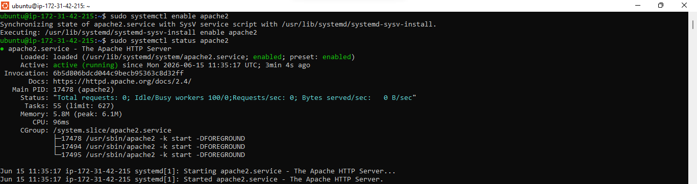

# AWS-Based LAMP Stack Deployment and Configuration

## Overview

This project demonstrates the deployment of a complete LAMP (Linux, Apache, MySQL, and PHP) environment on an Amazon EC2 instance. The objective was to provision a cloud server, install the required software components, configure a web hosting environment, and validate that dynamic PHP content could be served successfully.

---

## Environment Preparation

Before beginning the installation process, an Ubuntu 24.04 LTS EC2 instance of type t3.micro was provisioned within the eu-north-1 AWS region.

.png>)


An SSH key pair named **lamp-ec2-key** was created and downloaded to provide secure administrative access to the server.

The instance security group was configured to allow the following inbound traffic:

- HTTP (Port 80):source from anywhere on the internet.
- HTTPS (Port 443):source from anywhere on the internet.
- SSH (Port 22):source from any IP address

.png>)

The deployment used the default AWS VPC and subnet configuration.


After adjusting file permissions on the private key, an SSH connection was established with the instance.

```
chmod 400 lamp-ec2-key.pem
```

```
ssh -i "lamp-ec2-key.pem" ubuntu@184.72.210.143
```

The connection was made using the default Ubuntu user account and the public IP assigned to the instance.


---

## Deploying the Apache Web Server

The first task on the server was to update the operating system packages and install Apache.

```
sudo apt update
sudo apt upgrade -y
```


Apache was then installed using the Ubuntu package manager.

```
sudo apt install apache2 -y
```


After installation, the service was enabled and verified.

```
sudo systemctl enable apache2
sudo systemctl status apache2
```

A running status confirmed that the web server was operating correctly.



Local connectivity testing was performed with curl.

```
curl http://localhost:80
OR
curl http://127.0.0.1:80
```


External validation was completed by opening the public IP address in a browser.

```
http://184.72.210.143:80
```


The successful display of the default Apache page confirmed that the service was accessible from outside the instance.

---

## Installing and Securing MySQL

To provide database functionality for the application stack, MySQL Server was installed.

```
sudo apt install mysql-server
```


The database service was started and configured to launch automatically.

```
sudo systemctl enable --now mysql
sudo systemctl status mysql
```

Administrative access was obtained through the MySQL shell.

```
sudo mysql
```

A password was configured for the root account.

```
ALTER USER 'root'@'localhost' IDENTIFIED WITH mysql_native_password BY '!Aexite';
```


```
exit
```

To strengthen security, the MySQL hardening utility was executed.

```
sudo mysql_secure_installation
```


The configuration wizard was used to remove insecure defaults and improve database security.

A final login test was performed.

```
sudo mysql -p
```


```
exit
```

---

## Installing the PHP Runtime

With Apache and MySQL in place, PHP was added to enable server-side processing of dynamic content.

```
sudo apt install php libapache2-mod-php php-mysql
```


The installation was validated by checking the installed version.

```
php -v
```


At this stage, the core LAMP stack components had been successfully deployed.

---

## Creating a Dedicated Website Environment

Rather than using Apache's default web directory, a dedicated document root was created for the project.

```
sudo mkdir /var/www/projectlamp
```

```
sudo chown -R $USER:$USER /var/www/projectlamp
```


A new Virtual Host definition was then created.

```
sudo vim /etc/apache2/sites-available/projectlamp.conf
```

```
<VirtualHost *:80>
  ServerName lampProject
  ServerAlias www.lampProject
  ServerAdmin webmaster@localhost
  DocumentRoot /var/www/lampProject
  ErrorLog ${APACHE_LOG_DIR}/error.log
  CustomLog ${APACHE_LOG_DIR}/access.log combined
</VirtualHost>
```


Apache configuration files were reviewed.

```
sudo ls /etc/apache2/sites-available
```

```
Output:
000-default.conf default-ssl.conf lampProject.conf
```


The new site was enabled while the default site was disabled.

```
sudo a2ensite projectlamp
```

```
sudo a2dissite 000-default
```


Configuration syntax was verified.

```
sudo apache2ctl configtest
```

Apache was reloaded to activate the changes.

```
sudo systemctl reload apache2
```


A temporary landing page was created to validate the virtual host configuration.


The site was then accessed through both the public IP address and public DNS hostname.


---

## Enabling PHP Processing

Apache prioritizes index.html by default. To allow PHP pages to become the primary entry point, the DirectoryIndex configuration was adjusted.

```
sudo vim /etc/apache2/mods-enabled/dir.conf
```

```
<IfModule mod_dir.c>
  DirectoryIndex index.php index.html index.cgi index.pl index.xhtml index.htm
</IfModule>
```


The web server configuration was reloaded.

```
sudo systemctl reload apache2
```


A PHP test page was created.

```
vim /var/www/lampProject/index.php
```

```
<?php
phpinfo();
```


After refreshing the browser, PHP configuration details were displayed successfully.


The test file was removed after verification because it exposes sensitive environment information.

```
sudo rm /var/www/projectlamp/index.php
```

---

## Project Outcome

The deployment was completed successfully, resulting in a fully functional LAMP environment hosted on AWS. Apache served web content, MySQL provided database services, and PHP enabled dynamic application processing. Through the use of Apache Virtual Hosts, the environment was structured for future application deployment while following standard server administration and security practices.
